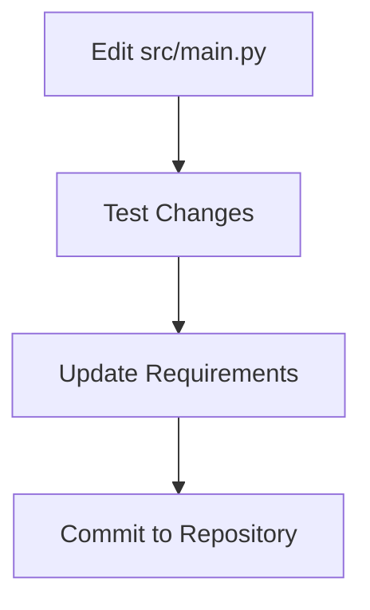

# Protein 3D Structure Analysis Suite

A comprehensive tool for analyzing protein structures from the PDB with 3D visualization, feature engineering, and machine learning classification.

---

## Repository Structure & Purpose

### 📁 `src/` - Core Application Code
**Purpose**: Contains all Python source code for the analysis pipeline  
**Audience**: Developers, Contributors  
**Key Files**:
- `main.py`: Central script with all core functionalities
- **Usage**:
  ```python
  # Import specific functions for advanced usage
  from src.main import run_analysis, create_interface
  ```

### 📁 `notebooks/` - Interactive Demo
**Purpose**: Jupyter Notebook interface for end-users  
**Audience**: Researchers, Students, Non-coders  
**Key Files**:
- `demo.ipynb`: Ready-to-run interface (primary user entry point)
- **Usage**:
  ```bash
  jupyter notebook notebooks/demo.ipynb
  ```

### 📁 `screenshots/` (Optional) - Documentation Assets
**Purpose**: Stores visual examples for documentation  
**Audience**: Documentation Maintainers  
**Usage**: Update when adding new features to keep visuals current

---

## 👥 Audience Guide

### 1. End-Users (Biologists/Researchers)
**Focus**: `notebooks/`  
**What You'll Do**:
1. Run the Jupyter Notebook interface
2. Input PDB IDs through widgets
3. View interactive 3D visualizations
4. Generate analysis reports

### 2. Developers/Contributors
**Focus**: `src/` + `requirements.txt`  
**What You'll Do**:
1. Modify core logic in `main.py`
2. Add new features to the analysis pipeline
3. Improve machine learning components
4. Update dependencies in `requirements.txt`

### 3. Educators/Students
**Focus**: `notebooks/` + `src/`  
**What You'll Do**:
1. Study the demo notebook for workflow examples
2. Experiment with code in `src/` for learning purposes
3. Modify visualization parameters for custom analyses

---

## 🛠️ Installation & Setup

```bash
# For All Users
git clone https://github.com/tabasaleemm/protein-3d-analysis-tool.git
cd protein-3d-analysis-tool
pip install -r requirements.txt

# For BioPython Users
pip install biopython
```

---

## 🚀 Usage Workflow

### End-User Flow
```mermaid
graph TD
    A[Open notebooks/demo.ipynb] --> B[Run create_interface()]
    B --> C[Input PDB ID]
    C --> D[View Interactive Report]

```

### Developer Flow


---

## 📚 Folder Cheat Sheet

| Folder | Contains | Modified By |
|--------|----------|-------------|
| `notebooks/` | User interface | End-users via Jupyter |
| `src/` | Analysis engine | Python developers |
| `screenshots/` | Documentation assets | Project maintainers |
