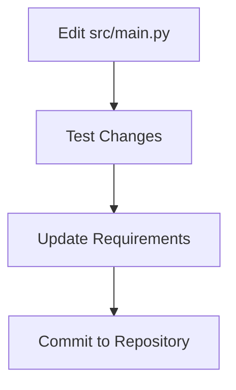

# Protein 3D Structure Analysis Suite

A comprehensive tool for analyzing protein structures from the PDB with 3D visualization, feature engineering, and machine learning classification.

---

## 📂 Repository Structure & Purpose

### `src/` - Core Application Code
- **Purpose**: Contains Python source code for the analysis pipeline
- **Audience**: Developers
- **Key File**: `main.py` (Central script)

### `notebooks/` - Interactive Interface
- **Purpose**: Jupyter Notebook for end-users
- **Audience**: Researchers/Students
- **Key File**: `demo.ipynb` (Ready-to-run demo)

### `screenshots/` (Optional) - Visual Examples
- **Purpose**: Documentation assets
- **Audience**: Maintainers

---

## 👥 Audience Guide

| User Type               | Primary Folder      | Activities                              |
|-------------------------|---------------------|-----------------------------------------|
| Biologists/Researchers  | `notebooks/`        | Run interface, view 3D visualizations   |
| Developers              | `src/`              | Modify core logic, add features         |
| Educators               | Both folders        | Teach using demo, experiment with code  |

---

## 🛠️ Installation

```bash
git clone https://github.com/tabasaleemm/protein-3d-analysis-tool.git
cd protein-3d-analysis-tool
pip install -r requirements.txt
pip install biopython  # If not already installed
```

---

## 🚀 Usage Workflow

### End-User Flow
```mermaid
graph TD
    A[Open notebooks/demo.ipynb] --> B[Run create_interface()]
    B --> C[Input PDB ID]
    C --> D[View Interactive Report]
```

### Developer Flow


---

## 📸 Example Interface (Optional)
Add screenshots to `screenshots/` folder:
```bash
mkdir screenshots
# Add your PNG files here
```

---

## 📚 Folder Cheat Sheet

| Folder         | Maintained By       | Key Contents                 |
|----------------|---------------------|------------------------------|
| `notebooks/`   | End-users           | Jupyter interface            |
| `src/`         | Developers          | Python source code           |
| `screenshots/` | Documentation team  | Example images               |

> **Note**: Test diagrams at [Mermaid Live Editor](https://mermaid-js.github.io/mermaid-live-editor/)
