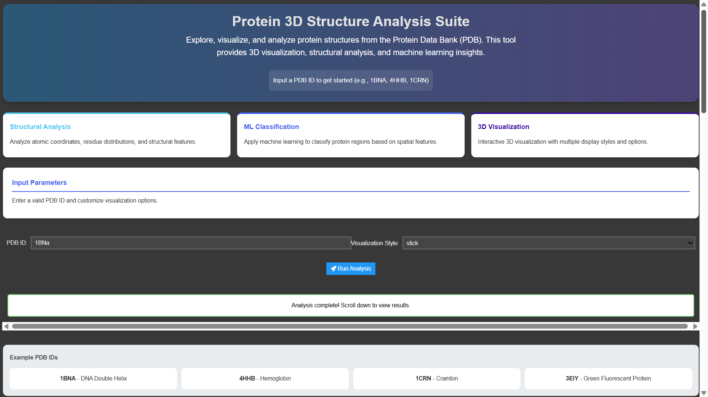

# Protein 3D Structure Analysis Suite

A comprehensive tool for analyzing protein structures from the PDB with 3D visualization, feature engineering, and machine learning classification.

## Features
- PDB file fetching and metadata extraction
- Interactive 3D visualization with multiple display styles
- Structural feature engineering (spatial coordinates, angles, distances)
- Random Forest classification of structural regions
- Automated report generation with visualizations
- Jupyter-based interactive interface

---

## Installation
```bash
# Clone the repository
git clone https://github.com/talhasaleemm/protein-3d-analysis-tool.git
cd protein-3d-analysis-tool

# Install dependencies
pip install -r requirements.txt

# Install BioPython (if not already included)
pip install biopython
```

---

## Usage

### 1. Launch the Jupyter Interface
```bash
jupyter notebook
```
- Open the demo notebook:  
  **`notebooks/demo.ipynb`**

### 2. Interactive Analysis
1. **Enter a PDB ID** (e.g., `1BNA`, `4HHB`, `1CRN`)  
   

2. **Select Visualization Style**:  
   Choose from `cartoon`, `stick`, `sphere`, or `surface`  
   

3. Click **"Run Analysis"** to generate:
   - 3D interactive visualization
   - Machine learning performance metrics
   - Feature importance plots
   - Structural metadata report

### 3. Example Output


---

### Command-Line Usage (Optional)
Run directly from Python:
```python
from src.main import run_analysis

# Generate analysis report for a PDB structure
df, model = run_analysis('1BNA', view_style='surface')
```

---

## Notes
- **Google Colab Users**: Enable widgets first:
  ```python
  from google.colab import output
  output.enable_custom_widget_manager()
  ```
- Valid PDB IDs can be found on the [RCSB PDB website](https://www.rcsb.org/)
- Large structures (>10,000 atoms) may take longer to process

---

## Repository Structure
```
├── notebooks/
│   └── demo.ipynb       # Interactive demo notebook
├── src/
│   └── main.py          # Core analysis logic
├── requirements.txt     # Python dependencies
└── README.md            # This document
```
